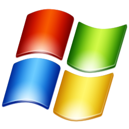
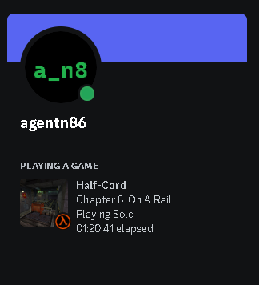

# Half-Cord

Half-Cord is a simple implementation of adding Discord's rich presence to Half-Life. This project is currently **in progress,** so expect bugs and more. This project will be open source once its released. This project will firsted be worked on in  Windows, so Mac and Linux will come next once the Windows version is done.

# Example
Here is an example of the rich presence in action.

# Credits
This project uses the Discord rich presence API. You can get it yourself at [https://github.com/discord/discord-rpc/releases](https://github.com/discord/discord-rpc/releases). I would also like to thank the [VALVE software wiki](https://developer.valvesoftware.com/wiki/Implementing_Discord_RPC), for a starting hand.
